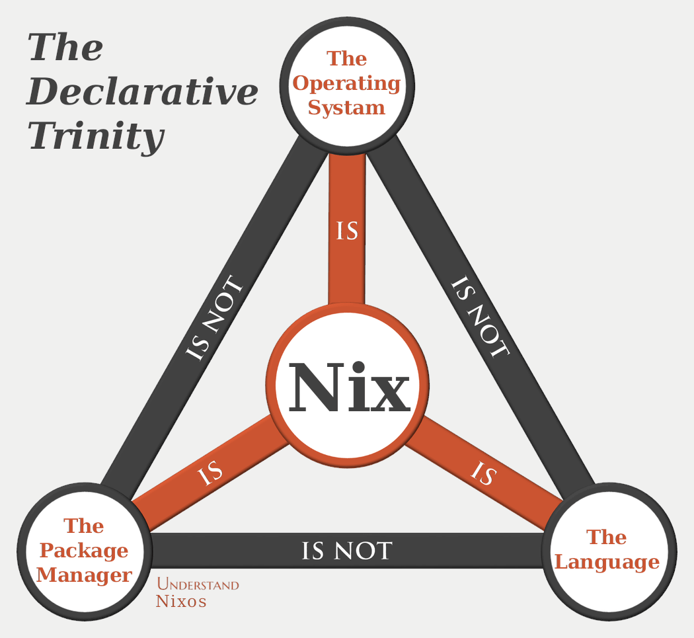

<h1 align="center">
Постигаем безумие декларативного конфигурирования
</h1>

> [!WARNING]
>
> Статья еще не закончена и требует больших исправлений и доработок.

Благодаря моим активным экспериментам над технологиями, я регулярно сталкиваюсь
с желанием удалить все и начать заново. Регулярные ошибки при навязчивых обновлениях
как вишенка на торте разочарования. Последней каплей стал полный дроп моей
Manjaro Linux. И хотя причиной стали мои кривые руки, проходить через
решение бесконечных проблем или инициализацию дистрибутива по новой мне не хотелось.

Здесь я расскажу о том как я добился **полностью воспроизводимой** системы. О плюсах и минусах декларативного **безумия**, а также о побочных находках, про которые я рекомендую всем и каждому для ознакомления.

## Экосистема Nix

Когда говоришь **Nix** - можно иметь ввиду три
разные вещи. Nix это функциональный язык программирования, который используется в пакетном менеджере Nix, причем оба являются частью дистрибутива Nix (Сокращение Nixos).

Все три части являются обязательными для погружения в декларативное безумие внутри экосистемы. Чтобы лучше в этом разобраться я приведу пример своего использования.

### Дистрибутив Nixos

### Замена серии инструментов на Nix

## Итоги

Благодаря экосистеме Nix я имею полностью воспроизводимую систему, с которой можно ознакомиться в [моем репозитории](https://github.com/shuritch/nixos). Теперь при любой ошибке я могу откатиться на ее предыдущее состояние или полностью сбросить систему за 20 минут, не мучаясь с установкой и настройкой любимых программ. Также это позволяет частично синхронизировать мои устройства, не допуская ненужных пересечений.

Кроме того, теперь я регулярно использую Nix как замену
серии инструментов для локальной разработки. Что дает гибкость в управлении и большую воспроизводимость.

Тех же результатов можно добиться императивно, написав серию bash скриптов, но мне кажется это было бы еще большим безумством.
